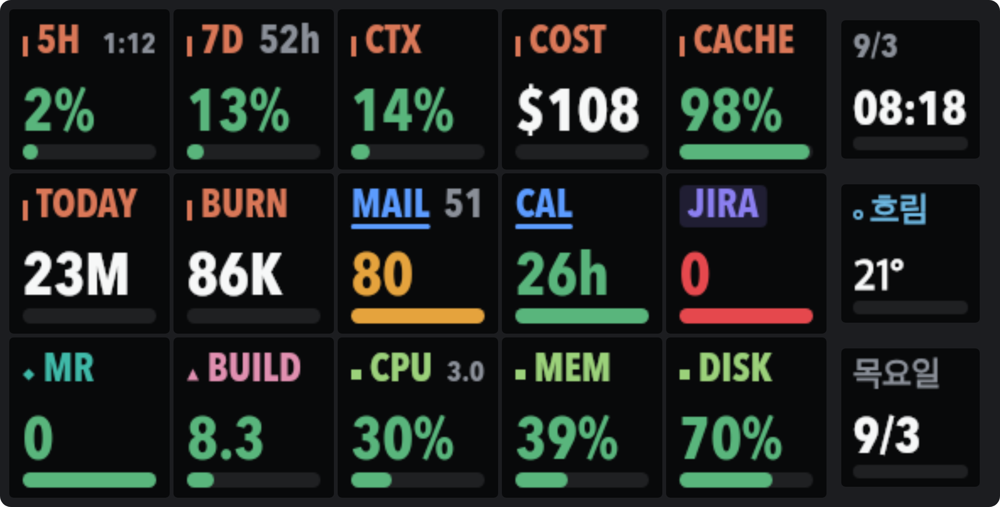
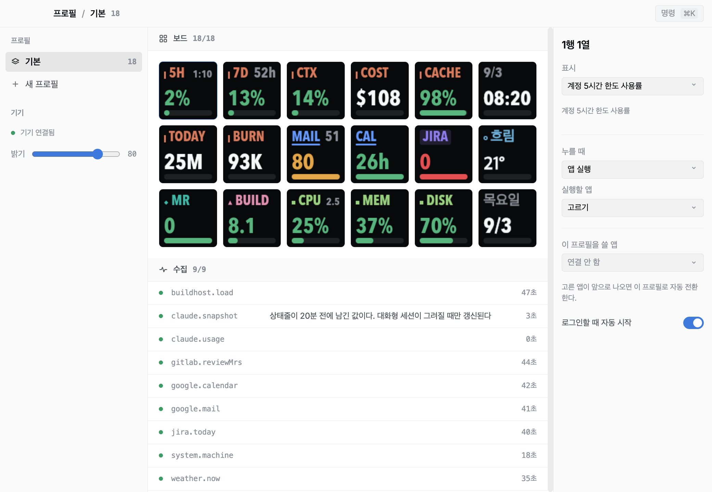
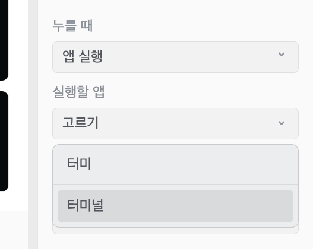
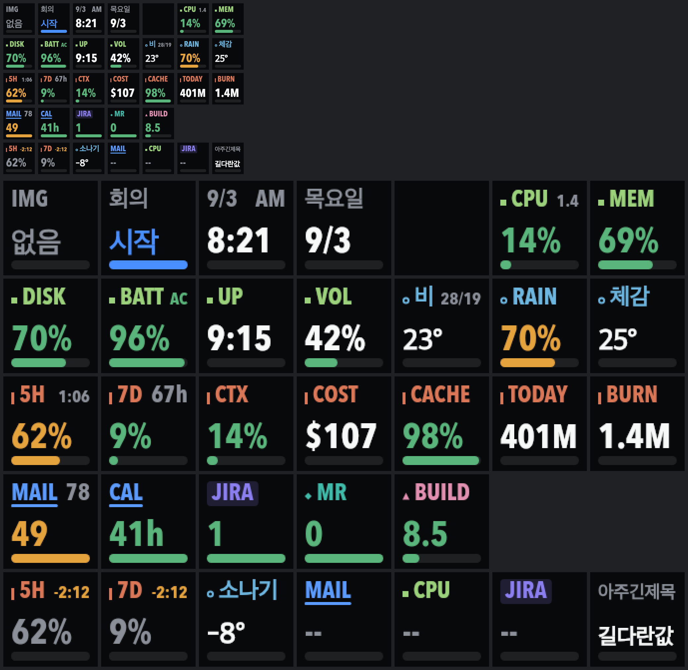

# Stream Dock for macOS

Mirabox Stream Dock 293S를 macOS에서 직접 구동하는 앱. 벤더 앱 없이 HID로
기기와 통신해 키에 정보를 그리고 키 입력을 받는다.



위 그림은 목업이 아니라 실제로 기기에 전송되는 18칸 그대로다. `tools/board.ts`
가 현재 설정과 실시간 값으로 만든다.

## 왜 만드나

벤더 앱(StreamDock.app)이 불안정했다. 2026-09-02 관측 기준 3분에서 7분 간격으로
스스로 종료됐고, 죽기 직전 로그에는 Qt 페인팅 실패가 반복됐다. 설치된 빌드
(3.10.190.421)가 공개 최신판(3.10.185.1120)보다 높아 업그레이드로 해결할 수
없었다. 실행 파일은 2025년 6월 빌드인데 호스트는 macOS 26.5다.

## 지원 기기

**Mirabox Stream Dock 293S** 에서 개발하고 검증했다. 아래는 실제 장비에서 읽은
값이다.

| 항목 | 값 |
| --- | --- |
| 제품 | Mirabox Stream Dock 293S |
| USB Vendor ID | `0x5548` |
| USB Product ID | `0x6670` |
| USB 제품명 문자열 | **없음** (빈 문자열) |
| bcdDevice | `0x0300` |
| 펌웨어 | `V2.293S.00.003` |
| HID usage page | `0xFFA0` (벤더 정의) |
| 키 배열 | 6 x 3 = 18 (본체 15 + 사이드 3) |
| 키 화면 | 본체 95x95, 사이드 82x82 |

기기가 USB 제품명을 비워서 보내므로 이름으로는 찾을 수 없다. 반드시 Vendor ID
`0x5548` 로 찾아야 한다.

이 저장소가 확인한 것은 293S 하나뿐이다. 같은 프로토콜을 쓰는 Mirabox 의 다른
모델도 될 가능성이 있지만 검증하지 않았다. 자기 기기의 값을 확인하려면 아래를
쓴다.

```bash
npx tsx tools/identify.ts
```

이 도구는 기기를 열지 않고 정체만 읽는다. 앱이 돌고 있어도 안전하다.

macOS 26.5(Apple Silicon)에서 개발했다. **sudo 는 필요 없다.** 기기가 벤더 정의
HID usage page 를 써서 macOS 가 키보드나 마우스에 거는 제약을 받지 않는다.
Input Monitoring 권한도 필요 없다.

## 설치

### 내려받아 쓰기

[Releases](https://github.com/gangjoohyeong/mirabox-stream-dock-mac-app/releases)
에서 `.app` 을 받아 `/Applications` 에 넣는다.

서명하지 않으므로 처음 열 때 Gatekeeper 가 막는다. Finder 에서 우클릭 후 열기를
한 번 해 주면 이후로는 그냥 열린다.

### 소스에서 빌드

```bash
npm install
npm run dist
```

`dist/mac-arm64/Stream Dock.app` 이 나온다. `node-hid` 와 `@napi-rs/canvas` 는
네이티브 모듈이라, npm 이 설치 스크립트를 막으면
`npm rebuild --foreground-scripts` 로 한 번 더 돌린다.

### 벤더 앱을 먼저 끈다

기기는 한 프로세스만 점유할 수 있다. StreamDock.app 이 떠 있으면 이 앱이 기기를
열지 못한다.

```bash
osascript -e 'tell application "StreamDock" to quit'
```

## 조작 화면



세 칸으로 나뉜다.

- 왼쪽: 프로필 목록, 기기 상태, 밝기
- 가운데: 6x3 보드와 수집 상태. 보드는 기기에 나가는 그림 그대로다
- 오른쪽: 고른 칸의 표시 항목, 누를 때 할 일, 항목별 설정

`Cmd+K` 로 명령 팔레트를 연다. 보드에서는 방향키와 `hjkl` 로 칸을 옮기고
`Enter` 로 표시 항목을 고른다.

창을 닫아도 앱은 메뉴 막대에 남아 계속 기기를 그린다. 완전히 끄려면 메뉴
막대에서 종료를 고른다. 로그인할 때 자동으로 시작하게 할 수 있고, 그때는 창
없이 메뉴 막대로만 뜬다.

### 키를 눌렀을 때

앱 실행, 링크 열기, 셸 명령, 미디어 조작(재생/정지, 이전/다음, 음량) 중에서
고른다. 앱은 설치된 목록에서 검색해 고른다.



프로필에 앱을 묶어 두면 그 앱이 앞으로 나올 때 보드가 자동으로 바뀐다. 앱은
이름이 아니라 번들 ID 로 붙잡는다. 같은 앱이 파일명(`Visual Studio Code`),
표시 이름(`Code`), 현지화 이름(`텍스트 편집기`)으로 제각각 불려서 이름으로는
어긋난다.

## 표시할 수 있는 것

키는 어디서 온 값인지로 묶인다. 조작 화면에서는 묶음으로 나오고, 기기에서는
라벨의 색과 라벨에 붙는 작은 도형이 묶음을 알린다. 도형이 주된 구분이고 색은
거들 뿐이다. 색만으로 나누면 책상 거리에서 헷갈린다.



맨 아랫줄은 특수 상황이다. 값이 낡았을 때, 라벨이 길 때, 아직 아무것도 못
받았을 때.

| 묶음 | 표식 | 키 |
| --- | --- | --- |
| Claude | 막대 | `5H` `7D` `CTX` `COST` `CACHE` `TODAY` `BURN` |
| Google | 밑줄 | `MAIL` `CAL` |
| Atlassian | 알약 | `JIRA` |
| GitLab | 마름모 | `MR` |
| 빌드 서버 | 삼각 | `BUILD` |
| 날씨 | 동그라미 | `WEATHER` `RAIN` `FEELS` |
| 내 맥 | 네모 | `CPU` `MEM` `DISK` `BATT` `UP` `VOL` |
| 기본 | 없음 | `CLOCK` `DATE` `BLANK` |
| 직접 넣기 | 없음 | `IMG` `TXT` |

| 키 | 내용 |
| --- | --- |
| 5H, 7D | Claude 계정 5시간, 7일 한도 사용률 |
| CTX, COST, CACHE | 최근 활동 세션의 컨텍스트, 누적 비용, 캐시 적중률 |
| TODAY, BURN | 오늘 누적 토큰, 현재 블록의 분당 소모 |
| MAIL, CAL | 안 읽은 메일 수, 다음 일정까지 남은 시간 |
| JIRA | 오늘 Jira 기록 |
| MR | 리뷰 대기 MR 수 |
| BUILD | 빌드 서버 부하와 디스크 |
| WEATHER, RAIN, FEELS | 기온과 하늘 상태, 강수 확률, 체감 온도와 바람 |
| CPU, MEM, DISK | 이 맥의 부하, 메모리, 디스크 |
| BATT, UP, VOL | 배터리, 켜 둔 시간, 출력 음량 |
| CLOCK, DATE | 현재 시각(12/24시간), 오늘 날짜와 요일 |
| IMG | 그림 파일. 채우는 방식과 아래 글자를 고른다 |
| TXT | 원하는 글자. 색과 아래 띠를 고른다 |
| BLANK | 빈 칸 |

보드에 올라온 키가 요구하는 것만 모은다. Jira 키를 안 쓰면 Jira 를 아예 부르지
않고, 날씨를 안 올리면 바깥으로 나가는 요청이 하나도 없다.

## 데이터 출처

자격증명은 전부 외부 도구가 들고 있다. 이 저장소에 비밀정보를 두지 않는다.
Claude, 날씨, 이 맥의 상태를 뺀 나머지는 만든 사람의 사내 환경에 맞춰져 있어서
그대로는 동작하지 않는다. `src/main/integrations/` 의 모듈을 갈아 끼우면 된다.

| 지표 | 출처 | 누구나 되나 |
| --- | --- | --- |
| Claude 한도, 컨텍스트, 비용, 캐시 | `~/.claude/usage-snapshot.json` | 훅 설정 필요 |
| 토큰 절대량과 소모 속도 | `~/.claude/projects/**/*.jsonl` | 된다 |
| 이 맥의 상태 | `sysctl`, `memory_pressure`, `df`, `pmset` | 된다 |
| 날씨 | Open-Meteo (키 없음) | 된다 |
| 안 읽은 메일, 다음 일정 | `gws` CLI | 사내 도구 |
| 오늘 Jira 기록 | `jira` CLI | 사내 도구 |
| 리뷰 대기 MR | GitLab REST + macOS 키체인 | 사내 GitLab |
| 빌드 서버 | `ssh sphere-build` | 사내 서버 |

Claude 계정 한도는 statusLine 훅 payload 에만 들어온다. `/usage` 를 비대화형으로
불러도 세션 요약만 나오고 한도는 없다. 훅이 그 payload 를
`~/.claude/usage-snapshot.json` 으로 떨구도록 해 두어야 `5H` 와 `7D` 가 채워진다.

그 훅은 대화형 세션이 상태줄을 그릴 때만 돈다. 조용한 시간에는 값이 몇 시간씩
멈춘다. 그래서 `5H` 와 `7D` 는 값이 20분 넘게 낡으면 색을 죽이고 오른쪽에 받은 지
얼마나 됐는지를 `-2:12` 처럼 적는다. 멈춘 값을 지금 값처럼 보여주지 않는다.

## 프로토콜

리버스 엔지니어링한 값이다. 전부 실제 장비에서 확인했다.

명령 프레임은 리포트 ID `0x00` 뒤에 ASCII `CRT\0\0` 를 붙이고 명령을 잇는다.

| 명령 | 뜻 |
| --- | --- |
| `CONNECT` | 세션 시작 |
| `DIS` | 세션 종료 |
| `CLE` | 지우기 (부팅 로딩 화면은 안 지워진다) |
| `LIG` | 밝기 |
| `BAT` | 키 이미지. 길이 BE16 + 키 ID 뒤에 JPEG |
| `STP` | 화면에 반영 |

키 이미지는 JPEG 이고 **반시계 90도** 돌려 보낸다. 기기 키 ID 는 왼쪽 위부터
행 우선으로 `0d 0a 07 04 01 10 / 0e 0b 08 05 02 11 / 0f 0c 09 06 03 12` 이다.

입력은 `ACK\0\0OK\0\0` 뒤 바이트 9 에 기기 키 ID 가 실려 온다. **뗄 때만** 온다.
우측 끝 열(논리 5, 11, 17)은 그림은 나가지만 입력 보고가 오지 않았다. 사이드
디스플레이 터치 영역이라 본체 키와 다르게 동작하는 것으로 보인다.

## 개발

```bash
npm run dev              # 개발 실행 (기기 필요)
npm run typecheck        # 타입 검사
npm run dist             # .app 패키징

npx tsx tools/identify.ts               # 기기 정체만 읽기 (열지 않는다)
npx tsx tools/probe.ts                  # 기기 통신 확인 (기기를 점유한다)
npx tsx tools/preview.ts /tmp/keys.png  # 모든 키를 한 장에 (기기 불필요)
npx tsx tools/board.ts /tmp/board.png   # 지금 설정을 기기 모양으로
npx tsx tools/rot-check.ts              # 회전 방향 확인 (기기 불필요)
npx tsx tools/registry-check.ts         # 등록소 목록 (기기 불필요)
```

연동을 하나 붙이려면 `src/main/integrations/` 에 모듈을 만들고
`integrations/index.ts` 에 한 줄 넣으면 된다. 소스는 `source(이름, 초, fetch)`,
키는 `key({name, label, summary, family, sources, options, render})` 로 등록한다.

자세한 내용은 [AGENTS.md](AGENTS.md) 에 있다. 기기 사실, 디자인 규칙, 그리고
직접 부딪혀 본 함정들이 정리되어 있다.

## 라이선스

[MIT](LICENSE)
